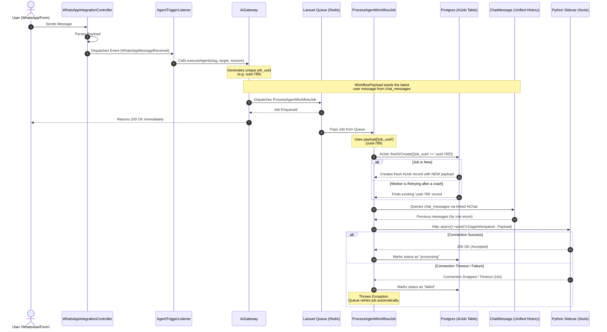

# AI Job Tracking Workflow

This document explains the full lifecycle of an AI job from the moment a trigger occurs (like a WhatsApp message or a form submission) to the execution by the Python sidecar. It also details why the `job_uuid` was introduced and how it solves critical bugs in payload handling. 

> **Note**: Since the unified chat history migration, message storage and history reconstruction now flow through `ai_chats` / `chat_messages`. The corrections are reflected in the workflow breakdown below. The `job_uuid` logic itself is unchanged.

## 1. The Core Problem Before `job_uuid`

Before the introduction of the `job_uuid`, the system had a major flaw in how it tracked interactions. 

When an AI job was dispatched to the queue, the worker attempted to create an tracking record in the database using `AiJob::firstOrCreate()`. It looked for an existing record based on:
- `tenant_id`
- `agent_slug`
- `target_id` (e.g., the Lead's ID)

### What went wrong?
1. **First Message**: User sends "Hello". The system creates an `AiJob` for Lead #123. The AI replies successfully.
2. **Second Message**: User sends "I want to buy". The system receives the webhook and dispatches a new job for Lead #123.
3. **The Bug**: The queue worker ran `firstOrCreate` looking for an `AiJob` for Lead #123. It **found the old record from the first message!** Instead of creating a new job with the "I want to buy" payload, it reused the old "Hello" payload. 
4. **Result**: The AI would either reply to the first message again, or the webhook controller would skip processing because the old job was already marked as `completed`.

## 2. The Solution: Generating a Unique `job_uuid` Upfront

To fix this, we needed a way to uniquely identify **each specific interaction** rather than just the target entity. 

We introduced a `job_uuid` generation at the very top of the workflow in `AiGateway.php`:

```php
// In AiGateway.php
$contextPayload->setTempValue('job_uuid', (string) \Illuminate\Support\Str::uuid());
```

And updated the queue worker to use it as the primary lookup key:

```php
// In ProcessAgentWorkflowJob.php
$aiJobRecord = AiJob::firstOrCreate(
    [
        'job_uuid' => $this->payload->getTempValue('job_uuid') ?? (string) Str::uuid(),
    ],
    // ... payload data ...
);
```

### Why this is the perfect solution:
- **New Interactions Get New Records**: When a new WhatsApp message arrives, `AiGateway` runs synchronously and generates a brand new UUID (e.g., `abc-123`). The queue worker sees this UUID, doesn't find it in the DB, and creates a fresh `AiJob` record with the *new* payload.
- **Retries Are Idempotent (Safe)**: If the Laravel Queue Worker crashes halfway through processing the job, Laravel automatically retries it. Because the `job_uuid` is baked into the queued payload, the retry uses the *same* `job_uuid` (`abc-123`). `firstOrCreate` finds the existing pending record and updates it, preventing duplicate database entries for the same message!

---

## 3. Full Workflow Diagram

Here is the complete chronological flow of an interaction.



### Step-by-Step Breakdown

1. **Ingress**: A webhook or form submission hits the API. The controller creates/updates the `Lead` and `LeadChatSession`, and records the inbound message as a **`ChatMessage`** bound to the lead's `AiChat`. (The old `message_received` entry in `lead_activities` is deprecated.)
2. **Event Dispatch**: The controller fires an event (e.g., `WhatsAppMessageReceived`). The `AgentTriggerListener` catches it.
3. **Gateway Preparation**: The listener passes the data to `AiGateway`. The Gateway resolves the necessary context (variables, tools) into a massive `WorkflowPayload`. The latest incoming user message is seeded directly from `chat_messages` to fuel the AI orchestration. 
    - **CRITICAL STEP**: The gateway attaches a unique `job_uuid` to this payload.
    - The gateway serializes this payload and throws it onto the Redis queue. The web request finishes and returns a fast 200 OK to the provider (Meta/WhatsApp).
4. **Worker Processing**: The background queue worker (`ProcessAgentWorkflowJob`) picks up the payload. It runs `AiJob::firstOrCreate` using the `job_uuid`. 
    - It also reconstructs the LLM chat history by querying **`chat_messages`** via the linked `AiChat`, using the `role` enum — instead of parsing legacy `lead_activities`.
5. **Handoff**: The worker translates the payload into JSON and fires an asynchronous, short-timeout HTTP request to the Python Sidecar's `/v1/agent/enqueue` endpoint.
    - If the Python Sidecar accepts it, the job is marked `processing` in Postgres, and the worker process finishes successfully.
    - If the Python sidecar is unresponsive or times out, the worker throws an exception, marks the job `failed`, and Laravel safely retries the job later (reusing the same UUID).