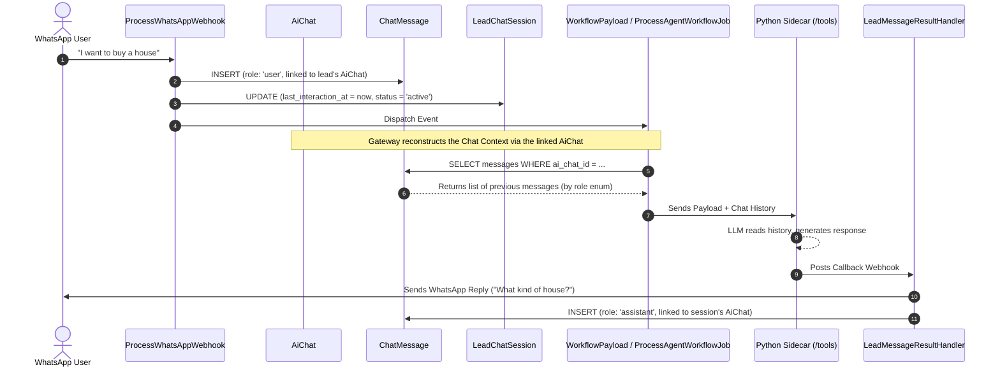

# Lead Chat Session & Message Recording Flow

This document explains how WhatsApp conversations are recorded in the system, how chat history is maintained, and how the AI retrieves this history to maintain context. The system now uses a **unified chat history** (`ai_chats` / `chat_messages`) shared across the Web Widget, WhatsApp, and future integrations.

## 1. Is the `attempts` column in `AiJob` useless?

**No, it is not useless.**

While it is true that every *new* webhook generates a fresh `job_uuid` and creates a new `AiJob` record, the `attempts` column tracks **internal Laravel Queue Worker failures**.

If the Laravel queue worker picks up the job and fails mid-execution (for example: the database deadlocks, or the Python Sidecar is completely down and throws a connection timeout), Laravel pushes the job back to the Redis queue for a retry. When it retries, it uses the exact same `job_uuid`, meaning it reuses the same `AiJob` record. If you choose to log retries, the `attempts` column tells you how many times the queue worker tried to process that specific webhook before succeeding or moving to the failed jobs table.

---

## 2. How Messages are Recorded

The system now uses two primary models to track conversations: `AiChat` and `ChatMessage`, with `LeadChatSession` managing WhatsApp-specific session state.

### **ChatMessage**: The Actual Message Store
Messages are **no longer** recorded as `message_received` / `ai_reply` entries in `lead_activities`. Instead, all messages are stored in the unified **`chat_messages`** table.

- **Inbound Messages (User)**: When `ProcessWhatsAppWebhook.php` receives a webhook, it creates a `ChatMessage` bound to the lead's `AiChat` with `role = 'user'`.
- **Outbound Messages (AI/Agent)**: When the AI finishes processing, `LeadMessageResultHandler.php` creates a `ChatMessage` bound to the session's underlying `AiChat` with `role = 'assistant'`.
- **Extras**: `platform_message_id` enables deduplication, and the `metadata` JSONB column stores thought streams. The `user_id` column is nullable to accommodate system/lead messages.

### **AiChat**: The Unified Chat Container
The `AiChat` model is the container for a conversation. It is **polymorphic** (`target_type` / `target_id`), so it can attach to a lead or any other target. It also carries `platform` (WhatsApp, Web Widget) and `status` columns, with proper indexing for high-speed multi-tenant lookups.

### **LeadChatSession**: The Session State Manager
The `LeadChatSession` model does not store the actual text of the messages. Instead, it acts as the "state machine" for the ongoing conversation on a specific channel (like WhatsApp).

It tracks:
- **Status**: Whether the AI is currently `active` (responding to the user) or `paused` (perhaps a human agent took over).
- **Metadata**: `platform` (WhatsApp), `platform_user_id` (phone number), and `message_count`.
- **Timestamps**: `last_interaction_at`, useful for cron jobs to detect abandoned carts or follow-up triggers.
- **Link**: An `ai_chat_id` foreign key, cleanly joining the platform-specific session state with the unified `AiChat` container.

---

## 3. The Full Conversation Flow

Here is how a message travels from the user to the database, and how the AI reads the history.



### Why is this architecture useful?

1. **Cross-Platform Consistency**: The Web Widget, WhatsApp, and future integrations all rely on the same `ai_chats` and `chat_messages` tables — one conversation format everywhere.
2. **Context Injection**: `WorkflowPayload` safely fetches the latest incoming user message directly from `chat_messages`, and `ProcessAgentWorkflowJob` rebuilds the LLM history by querying `chat_messages` via the linked `AiChat`, using the `role` enum. The AI "remembers" the conversation without the Python sidecar needing its own database.
3. **Handoffs**: If `LeadChatSession.status` is manually changed to `paused` by an agency employee, you can easily add logic to skip the AI triggers, effectively creating a Human Handoff feature.
4. **Clean Frontend**: `LeadActivityTimeline.vue` now has dual tabs. The **Timeline** tab shows only pure audit events (status changes, form completions, notes) — `message_received` and `ai_reply` items are excluded by the `LeadController` API. The **Chat History** tab embeds `AiChatRoom.vue` in read-only mode (props-driven, no textarea, no attachments) to replay the conversation.

---

## 4. Migrating Historical Data

Legacy messages still living in `lead_activities` were handled by a dedicated migration path:

- **`ChatHistoryMigrationSeeder.php`** traverses existing `message_received` and `ai_reply` records and transforms them into valid `ai_chats` and `chat_messages`, handling sender prefix cleanup, metadata mapping, and linking the legacy `LeadChatSession` to its new `AiChat`.

To apply the changes and migrate the history:

```bash
php artisan migrate
php artisan db:seed --class=ChatHistoryMigrationSeeder
```

**Validation**: Open a lead that has interacted with an AI agent. The Timeline should no longer be cluttered with chat bubbles, and the Chat History tab should render the read-only chat replay.