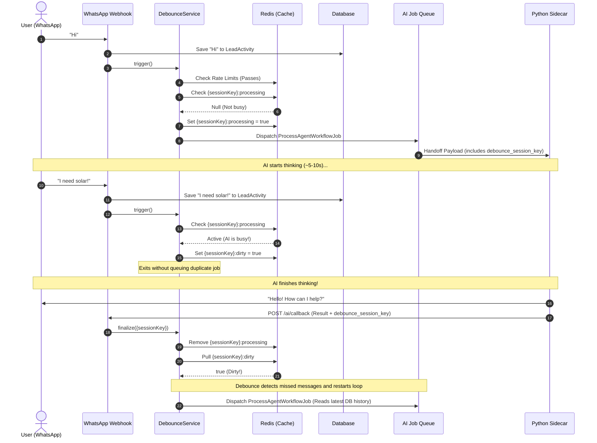

# Debounce Logic & `debounce_session_key`

This document explains the complete story of how debouncing, burst-protection, and the "Dirty Flag" pattern are designed to work for AI Chat sessions in the project.

## Overview
When users interact with an AI via a chat platform (like WhatsApp), they often send multiple rapid-fire messages (e.g., "Hello" ... "I need help" ... "With my solar bill"). 
Without debouncing, the system would trigger a separate AI Agent job for *each* message simultaneously. This causes race conditions, wastes LLM tokens, and results in the AI replying to the user multiple times out of context.

To solve this, the **`DebounceService`** implements a **Dirty Flag Pattern** using Redis/Cache to ensure that the AI only processes one batch of messages at a time per user, while queuing any messages that arrive while the AI is "thinking".

## Key Components

1. **`debounce_session_key`**: A unique identifier for the user's active chat session.
   - Format: `ai_debounce:{tenantId}:{platformUserId}`
2. **`processingLock`**: A cache key (`{sessionKey}:processing`) that acts as a mutex lock. If it exists, the AI is currently generating a response.
3. **`dirtyFlag`**: A cache key (`{sessionKey}:dirty`). If a user sends a message while the `processingLock` is active, this flag is set to `true`.
4. **Abuse Protection Limits**:
   - **Aggressive (Burst)**: Max 5 messages per 10 seconds (triggers a "slow down" warning).
   - **Sustained (Spam)**: Max 20 messages per 60 seconds (silently drops excess).

---

## The Complete Story (Step-by-Step Flow)

### 1. User Sends a Message
An incoming webhook (e.g., WhatsApp) hits the system. The controller calls `DebounceService::trigger($lead, $session)`.

### 2. Abuse Protection Check
The service checks the `RateLimiter`. If the user is spamming, it handles the limits (sending warnings or dropping the request). If safe, it proceeds.

### 3. The "Dirty Flag" Check (Mutex Lock)
The service checks the Cache for the `processingLock`:
- **If the lock IS active (AI is busy):**
  It simply sets the `dirtyFlag` to `true` and **stops**. No new AI job is queued. The user's message is already saved in the database, so it won't be lost.
- **If the lock is NOT active (AI is idle):**
  It sets the `processingLock` for 120 seconds and fires an event (e.g., `WhatsAppMessageReceived`) to queue the AI Job (`ProcessAgentWorkflowJob`).

### 4. Job Execution & State Passing
Inside `AiGateway`, the `debounce_session_key` is attached to the `WorkflowPayload`. This acts as a "receipt" so the background queue and the Python Sidecar know exactly which lock this job owns. 
*(Note: In the current codebase, this injection is commented out in `AiGateway.php`, temporarily disabling the finalize loop).*

### 5. AI Sidecar Completion & Webhook Callback
The Python sidecar finishes generating the LLM response, sends it to the user, and fires a webhook back to Laravel (`AiWebhookController`).

### 6. The "Finalize" Phase (Catch-up)
The `AiWebhookController` receives the `debounce_session_key` in the payload and calls `DebounceService::finalize()`.
- It **removes** the `processingLock`.
- It **checks and pulls** the `dirtyFlag`.
  - **If Dirty:** It means the user sent more messages while the AI was thinking. The service instantly re-triggers the process to let the AI read the newly arrived messages and respond again.
  - **If Clean:** The session goes idle, waiting for the next user interaction.

---

## Architecture Diagram

## Current Codebase Status Notice
While analyzing the code, I noticed that the finalization loop is currently disabled.
1. In `AiGateway.php`, the lines attaching the `debounce_session_key` to the payload are commented out.
2. In `AiWebhookController.php`, the call to `DebounceService::finalize($sessionKey)` is also commented out.

This means currently, if a user sends multiple messages rapidly, burst protection will stop excessive spam, but the dirty flag pattern won't automatically loop the AI back around to read messages missed during the lock window.
